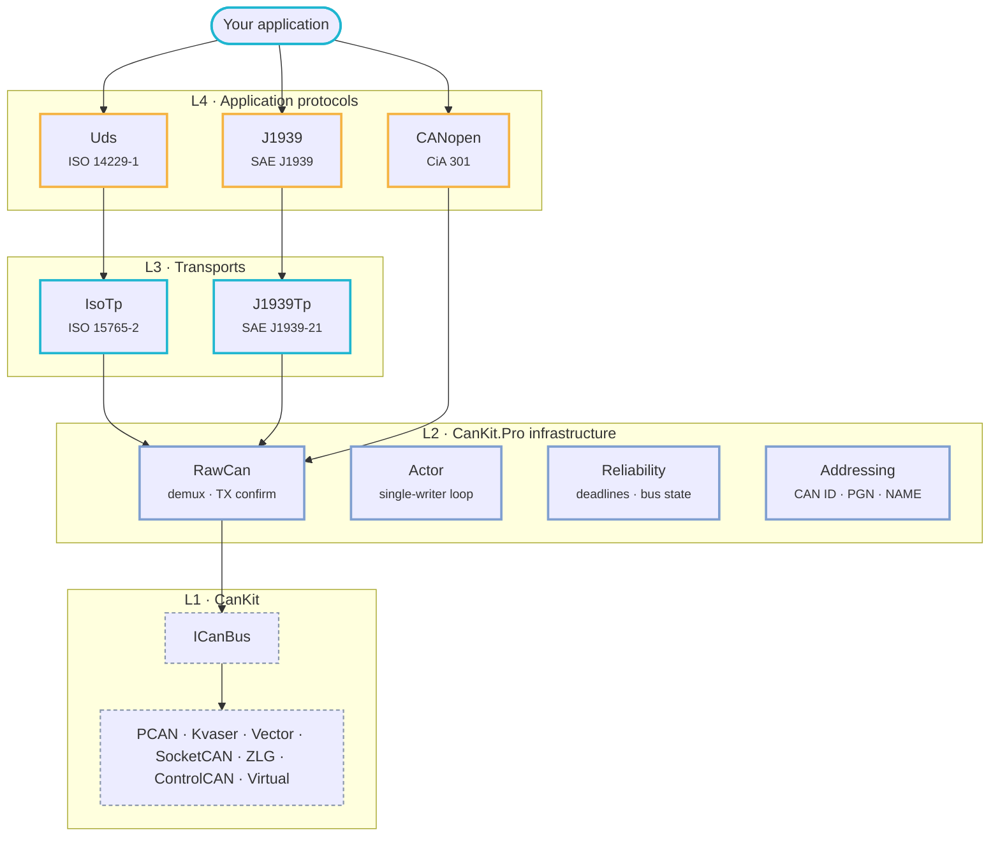

<div class="ck-home" markdown>

<section class="ck-hero" markdown>
<div class="ck-hero__grid" markdown>
<div markdown>

<span class="ck-hero__eyebrow">.NET · CAN · CAN FD · built on CanKit</span>

# Higher CAN protocol layers for <em>.NET</em> { .ck-hero__title }

Build **ISO-TP**, **UDS**, **CANopen** and **SAE J1939** applications on one shared,
vendor-neutral CAN bus, with a threading model, timeouts and TX confirmation that are
designed once instead of improvised in every stack.
{ .ck-hero__lead }

<div class="ck-hero__actions" markdown>
[Get started](getting-started.md){ .md-button .md-button--primary }
[Packages](packages/index.md){ .md-button }
[:fontawesome-brands-github: GitHub](https://github.com/dborgards/CanKit.Pro){ .md-button }
</div>

<div class="ck-hero__badges" markdown>
[](https://www.nuget.org/packages?q=CanKit.Pro)
[](https://github.com/dborgards/CanKit.Pro/actions/workflows/ci.yml)

[](https://github.com/dborgards/CanKit.Pro/blob/main/LICENSE)
</div>

!!! warning "Nothing to install from nuget.org right now"

    1.0.0 – 1.2.3 are withdrawn, and 1.3.0 is not out yet, so the version badge above reads from
    a feed with no listed release and `dotnet add package` has nothing to resolve. Build from
    source until 1.3.0 ships. See [Versioning](decisions/0001-versioning-and-api-stability.md).

</div>
<div class="ck-hero__code" markdown>

```csharp title="One bus, several protocols, nobody starves"
using var bus = CanBus.Open("virtual://demo/0",
    cfg => cfg.SetProtocolMode(CanProtocolMode.Can20).Baud(500_000));

using var service = new CanBusService(bus);

// Independent, filtered views of one bus: no fight over
// ReceiveAsync, no slow reader blocking a fast one.
using var diag = service.Subscribe(CanIdFilter.Range(0x700, 0x7FF));
using var tele = service.Subscribe(CanIdFilter.Range(0x100, 0x1FF));

// "Did it actually go out?" Echo-matched where the bus can,
// flagged where it can't. Never a hang.
var tx = await service.SendConfirmed(
    CanFrame.Classic(0x123, new byte[] { 1, 2, 3 }));

// Echoes are withheld unless a subscription asks for them, and every
// item carries the bus's echo flag and receive timestamp.
await foreach (var e in diag.Frames.WithCancellation(token))
    Console.WriteLine($"0x{e.Frame.ID:X3} len={e.Frame.Len}");
```

</div>
</div>
</section>

<section class="ck-section" markdown>

## Four protocols. One bus. One threading model.

Each stack is its own package and its own protocol instance. They share the bus through a
demultiplexer, run their state machines on a single-writer actor, and arm their timers on a
scheduler that guarantees an expired deadline is actually fired.
{ .ck-section__lead }

<div class="grid cards ck-cards-2" markdown>

-   :material-stethoscope:{ .lg .middle } __UDS__ <span class="ck-tag">L4</span>

    ---

    ISO 14229-1 client over ISO-TP. Sessions, security access, read and write by identifier,
    routine control, upload and download, P2/P2\* timing, 0x78 response-pending handled for you.

    [:octicons-arrow-right-24: CanKit.Pro.Uds](packages/uds.md)

-   :material-factory:{ .lg .middle } __CANopen__ <span class="ck-tag">L4</span>

    ---

    CiA 301 node: object dictionary, SDO client and server including block transfer, static and
    dynamic PDO mapping, NMT, heartbeat, node guarding, SYNC and EMCY.

    [:octicons-arrow-right-24: CanKit.Pro.CANopen](packages/canopen.md)

-   :material-truck:{ .lg .middle } __SAE J1939__ <span class="ck-tag">L4</span>

    ---

    Address claim with arbitrary-address fallback, PGN send and receive, SPN extraction,
    fixed-rate periodic send, and automatic routing through TP.BAM/TP.CM for payloads over 8 bytes.

    [:octicons-arrow-right-24: CanKit.Pro.J1939](packages/j1939.md) ·
    [CanKit.Pro.J1939Tp](packages/j1939tp.md)

-   :material-swap-vertical-bold:{ .lg .middle } __ISO-TP__ <span class="ck-tag">L3</span>

    ---

    ISO 15765-2 over CAN and CAN FD. Deterministic SF/FF/CF/FC codec, bounds-checked PCI parsing,
    STmin pacing without busy waits, N_As/N_Bs/N_Cr enforced, functional 1:N addressing.

    [:octicons-arrow-right-24: CanKit.Pro.IsoTp](packages/isotp.md)

</div>

</section>

<section class="ck-section" markdown>

## The layer underneath is the point

CanKit gives .NET a single, fast, vendor-neutral API for raw CAN and CAN FD frames. CanKit.Pro
adds the layer above it: the plumbing every real protocol stack needs and that people otherwise
rebuild, slightly differently and slightly wrong, in each one.
{ .ck-section__lead }

<div class="grid cards" markdown>

-   :material-call-split:{ .lg .middle } __Demultiplexing__

    ---

    `ICanBus.ReceiveAsync` is one stream. `CanBusService` turns it into N filtered, read-only
    subscriptions with their own bounded buffers, reconfigurable at runtime.

    [:octicons-arrow-right-24: RawCan](packages/rawcan.md)

-   :material-timeline-clock-outline:{ .lg .middle } __A threading model, not locks__

    ---

    `ProtocolActor`: one mailbox, one loop, work and timers strictly one at a time, one channel for
    background exceptions. State touched only through the actor needs no lock.

    [:octicons-arrow-right-24: Actor](packages/actor.md)

-   :material-timer-alert-outline:{ .lg .middle } __Timeouts that are checked__

    ---

    A `Deadline` is scheduled on the actor's own timer queue, so its expiry is dispatched and run
    rather than stored in a field nobody re-reads. Plus bus-state transitions, pushed to you.

    [:octicons-arrow-right-24: Reliability](packages/reliability.md)

-   :material-check-decagram-outline:{ .lg .middle } __Was it really sent?__

    ---

    `SendConfirmed` matches the hardware echo where the adapter provides one and falls back to
    driver acceptance where it does not, flagged so you can tell which answer you got.

    [:octicons-arrow-right-24: RawCan](packages/rawcan.md)

-   :material-identifier:{ .lg .middle } __CAN IDs without bit-twiddling__

    ---

    Validated 11/29-bit identifiers, J1939 PGN, priority, PDU format and source address composed
    and decomposed by name, NAME fields and PGN catalogues.

    [:octicons-arrow-right-24: Addressing](packages/addressing.md)

-   :material-source-branch-check:{ .lg .middle } __Built on CanKit, not a fork__

    ---

    CanKit.Pro consumes [CanKit](https://github.com/pkuyo/CanKit) from nuget.org exactly like your
    application does. Adapters, `ICanBus`, frames and timing stay upstream, where they belong.

    [:octicons-arrow-right-24: Contributing](contributing.md)

</div>

</section>

<section class="ck-section" markdown>

## One bus. Multiple protocols.

<div class="ck-diagram" markdown>



</div>

</section>

<section class="ck-section" markdown>

## Two minutes per protocol

Every snippet below is lifted from a runnable sample in the repository. They all work on the
hardware-free `virtual://` loopback adapter and, unchanged, on PCAN, Kvaser, Vector, SocketCAN
and the other CanKit adapters.
{ .ck-section__lead }

=== "ISO-TP"

    ```csharp
    using CanKit.Core;
    using CanKit.Pro.IsoTp;

    using var bus = CanBus.Open("virtual://demo/0",
        cfg => cfg.SetProtocolMode(CanProtocolMode.Can20).Baud(500_000));

    // Normal addressing: transmit on 0x7E0, receive on 0x7E8.
    using var channel = IsoTp.Open(bus, IsoTpEndpoint.Normal(txCanId: 0x7E0, rxCanId: 0x7E8));

    // 200 bytes go out as FF → FC → CF…; flow control, STmin pacing and the
    // N_As / N_Bs / N_Cr timers are the channel's job, not yours.
    await channel.SendAsync(payload, token);

    // …and come back reassembled, sequence-number checked.
    byte[] pdu = await channel.ReceiveAsync(token);
    ```

    ```bash
    dotnet run --project samples/CanKit.Pro.Sample.IsoTpQuickstart
    ```

=== "UDS"

    ```csharp
    using CanKit.Core;
    using CanKit.Pro.IsoTp;
    using CanKit.Pro.Uds;

    using var bus = CanBus.Open("virtual://demo/0",
        cfg => cfg.SetProtocolMode(CanProtocolMode.Can20).Baud(500_000));

    using var channel = IsoTp.Open(bus, IsoTpEndpoint.Normal(txCanId: 0x7E0, rxCanId: 0x7E8));
    using var uds = UdsClient.Create(channel, new UdsClientOptions
    {
        P2ClientMax     = TimeSpan.FromMilliseconds(50),
        P2StarClientMax = TimeSpan.FromSeconds(2),
    });

    await uds.DiagnosticSessionControlAsync(UdsSessionType.Extended, token);
    using var keepAlive = uds.StartTesterPresentKeepAlive();

    byte[] vin = await uds.ReadDataByIdentifierAsync(0xF190, token);

    await uds.SecurityAccessAsync(
        requestSeedLevel: 0x01,
        computeKey: seed => YourAlgorithm.ComputeKey(seed));
    ```

    ```bash
    dotnet run --project samples/CanKit.Pro.Sample.UdsQuickstart
    ```

=== "CANopen"

    ```csharp
    using CanKit.Core;
    using CanKit.Pro.CANopen;
    using CanKit.Pro.CANopen.Nmt;
    using CanKit.Pro.CANopen.Pdo;

    using var bus = CanBus.Open("virtual://demo/0",
        cfg => cfg.SetProtocolMode(CanProtocolMode.Can20).Baud(500_000));

    using var node = CanOpen.OpenNode(bus, nodeId: 0x01);

    // A 16-bit process value in the local OD, shipped by TPDO1 every 100 ms.
    node.ObjectDictionary.AddU16(0x2000, 0x00, 0x0000);
    node.ConfigureTpdo(1, new PdoMapping().Add(0x2000, 0x00, bitLength: 16),
        transmission: TpdoTransmission.EventTimer,
        eventTimerInterval: TimeSpan.FromMilliseconds(100));

    // SDO expedited write and read-back on a peer.
    await node.SdoDownloadAsync(serverNodeId: 0x11, index: 0x2000, subindex: 0x00, new byte[] { 0x34, 0x12 });
    byte[] raw = await node.SdoUploadAsync(serverNodeId: 0x11, index: 0x2000, subindex: 0x00);

    // Heartbeat, then bring the peer to Operational.
    node.StartHeartbeatProducer(TimeSpan.FromMilliseconds(200));
    await node.SendNmtCommandAsync(NmtCommand.Start, targetNodeId: 0x11);
    ```

    ```bash
    dotnet run --project samples/CanKit.Pro.Sample.CanOpenQuickstart
    ```

=== "J1939"

    ```csharp
    using CanKit.Core;
    using CanKit.Pro.Addressing;
    using CanKit.Pro.J1939;

    using var bus = CanBus.Open("virtual://demo/0",
        cfg => cfg.SetProtocolMode(CanProtocolMode.Can20).Baud(500_000));

    using var node = J1939Node.Open(bus, new J1939NodeOptions(myName));
    await node.ClaimAddressAsync(preferredAddress: 0x30);

    node.MessageReceived += (_, msg) =>
    {
        if (msg.Pgn != 0xF004) return;                            // EEC1
        double rpm = J1939Spn.Extract(msg.Payload.Span,          // SPN 190, engine speed
            byteOffset: 3, startBit: 0, bitLength: 16, resolution: 0.125, offset: 0.0);
    };

    await node.SendAsync(new J1939Message(0xF004, eec1, priority: 3));   // ≤ 8 bytes: one frame
    await node.SendAsync(new J1939Message(0xFEF0, big,  priority: 6));   // > 8 bytes: J1939-TP, automatically

    // Fixed-rate grid on the deadline scheduler: no drift from per-emission send time.
    using var periodic = node.StartPeriodicSend(
        new J1939Message(0xF004, eec1, priority: 3), TimeSpan.FromMilliseconds(100));
    ```

    ```bash
    dotnet run --project samples/CanKit.Pro.Sample.J1939Quickstart
    ```

=== "Raw CAN"

    ```csharp
    using CanKit.Core;
    using CanKit.Pro.Actor;
    using CanKit.Pro.RawCan;
    using CanKit.Pro.Reliability;

    using var bus = CanBus.Open("virtual://demo/0",
        cfg => cfg.SetProtocolMode(CanProtocolMode.Can20).Baud(500_000));

    using var service = new CanBusService(bus);

    // Allocation-free fast path: one ID range per protocol instance.
    using var isoTp = service.Subscribe(CanIdFilter.Range(0x700, 0x7FF));

    // Predicate when a range or acceptance mask is not enough.
    using var extended = service.Subscribe(e => e.Frame.IsExtendedFrame);

    // Timeouts and bus health, on the protocol instance's own single-threaded loop.
    using var actor = new ProtocolActor();
    using var monitor = new BusStateMonitor(bus, actor);
    monitor.StateChanged += (_, e) => { if (e.Current.IsTransmitBlocked()) AbortActiveTransfer(); };

    var deadline = new DeadlineScheduler(actor).Arm(TimeSpan.FromMilliseconds(150), OnTimeout);
    ```

    ```bash
    dotnet run --project samples/CanKit.Pro.Sample.Demux
    ```

</section>

<section class="ck-section" markdown>

## Install

```bash
# CanKit itself: the core plus one adapter for the hardware you talk to
dotnet add package CanKit.Core
dotnet add package CanKit.Adapter.Virtual     # loopback, no hardware
# dotnet add package CanKit.Adapter.PCAN      # or Kvaser, Vector, SocketCAN, ZLG, ControlCAN

# CanKit.Pro: the protocol you need brings its own infrastructure along
dotnet add package CanKit.Pro.Uds
```

Targets `netstandard2.0` and `net10.0`. MIT licensed. One version across all packages, cut by
semantic-release from Conventional Commits on `main`.

[Getting started](getting-started.md){ .md-button .md-button--primary }
[All packages](packages/index.md){ .md-button }
[Architecture (arc42)](architecture/arc42-CanKit.Pro.md){ .md-button }

</section>

</div>
