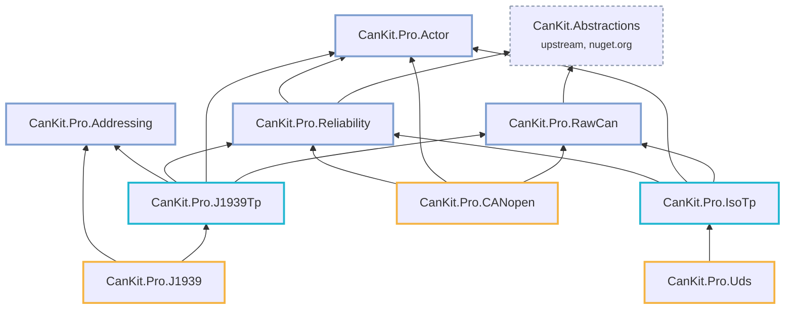

# Packages

Nine packages, one version number, released together to nuget.org. Take only the layers you need:
an ISO-TP application pulls in five of them, a plain demultiplexer one.

!!! warning "The 1.x releases are withdrawn"

    1.0.0 through 1.2.3 were published as stable before the API had been reviewed against the
    specifications, and are unlisted and deprecated on nuget.org. **1.3.0 will be the first
    release whose API is stable**; until it is tagged, the public surface can still change. See
    [Versioning](../decisions/0001-versioning-and-api-stability.md).

Everything targets `netstandard2.0` and `net10.0`, so .NET Framework 4.6.2+, .NET 8 and .NET 10
all work. Every package depends on `CanKit.Abstractions` where it touches a bus and on nothing
vendor-specific anywhere.

## L2 · Infrastructure

The layer every protocol stack needs and usually rebuilds: how instances share a bus, on which
thread state changes, how a timeout is guaranteed to fire, how an ID is composed.

<div class="ck-pkg-table" markdown>

| Package | | What it gives you | Depends on |
| --- | --- | --- | --- |
| [CanKit.Pro.RawCan](rawcan.md) | [](https://www.nuget.org/packages/CanKit.Pro.RawCan) | N independent, filtered, read-only views of one `ICanBus`, reconfigurable at runtime, plus `SendConfirmed` for a uniform TX confirmation. | CanKit.Abstractions |
| [CanKit.Pro.Actor](actor.md) | [](https://www.nuget.org/packages/CanKit.Pro.Actor) | `ProtocolActor`: single-mailbox, single-writer execution with an event-driven timer queue and one background-exception channel. | — |
| [CanKit.Pro.Addressing](addressing.md) | [](https://www.nuget.org/packages/CanKit.Pro.Addressing) | Validated 11/29-bit CAN IDs, J1939 PGN/priority/PDU/source-address composition, J1939 NAME and PGN catalogues. | — |
| [CanKit.Pro.Reliability](reliability.md) | [](https://www.nuget.org/packages/CanKit.Pro.Reliability) | Deadlines whose expiry is guaranteed to be checked, and a `BusStateMonitor` that pushes bus-state transitions and recovery. | CanKit.Abstractions, Actor |

</div>

## L3 · Transports

<div class="ck-pkg-table" markdown>

| Package | | What it gives you | Standard |
| --- | --- | --- | --- |
| [CanKit.Pro.IsoTp](isotp.md) | [](https://www.nuget.org/packages/CanKit.Pro.IsoTp) | SF/FF/CF/FC codec, bounds-checked PCI parsing, STmin pacing, and an actor-driven `IIsoTpChannel` over CAN and CAN FD; functional (1:N) addressing. | ISO 15765-2 |
| [CanKit.Pro.J1939Tp](j1939tp.md) | [](https://www.nuget.org/packages/CanKit.Pro.J1939Tp) | TP.BAM broadcast and TP.CM connection mode (RTS/CTS/EndOfMsgAck), multi-session, all timers on the actor. | SAE J1939-21 |

</div>

## L4 · Application protocols

<div class="ck-pkg-table" markdown>

| Package | | What it gives you | Standard |
| --- | --- | --- | --- |
| [CanKit.Pro.Uds](uds.md) | [](https://www.nuget.org/packages/CanKit.Pro.Uds) | Client over ISO-TP: session control, security access, read/write by identifier, routine control, upload/download, P2/P2\* timing and 0x78 response-pending. | ISO 14229-1 |
| [CanKit.Pro.CANopen](canopen.md) | [](https://www.nuget.org/packages/CanKit.Pro.CANopen) | Node with object dictionary, SDO client/server incl. block transfer, static and dynamic PDO mapping, NMT, heartbeat, node guarding, SYNC, EMCY. | CiA 301 |
| [CanKit.Pro.J1939](j1939.md) | [](https://www.nuget.org/packages/CanKit.Pro.J1939) | Node: address claim with arbitrary-address fallback, PGN send/receive with automatic TP routing, SPN extraction, fixed-rate periodic send. | SAE J1939 |

</div>

## Who depends on whom

Arrows point at dependencies. The L2 packages are leaves or nearly so; everything above composes
them and never talks to a vendor SDK.

<div class="ck-diagram" markdown>



</div>

## Install

```bash
# CanKit itself: the core plus one adapter for the hardware you talk to
dotnet add package CanKit.Core
dotnet add package CanKit.Adapter.Virtual     # loopback, no hardware
# dotnet add package CanKit.Adapter.PCAN      # or Kvaser, Vector, SocketCAN, ZLG, ControlCAN

# CanKit.Pro: the protocol you need brings its own infrastructure along
dotnet add package CanKit.Pro.Uds             # pulls IsoTp, RawCan, Actor, Reliability
dotnet add package CanKit.Pro.CANopen
dotnet add package CanKit.Pro.J1939           # pulls J1939Tp, Addressing, RawCan, Actor, Reliability
```

Each package page below is the package's own README, the same text that ships inside the
`.nupkg` and appears on nuget.org.
